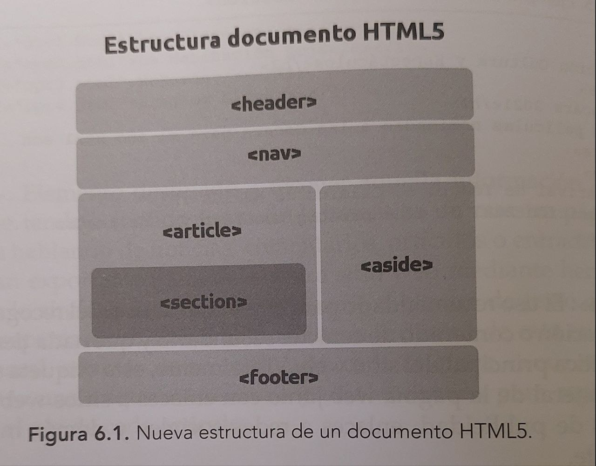

# HTML, CSS, JAVASCRIPT
## tabla de contenido
1. [HTML](#html)
2. [CSS](#css)
3. [JavaScript](#javascript)

## HTML
<table align="center">
  <tr border="none">
  <td width="50%" align="center">
  <h3>Estructura del documento HTML</h3>
    
  <!-- Imagen Natsu -->
  <td width="50%" align="center">
  
  </td>
  </tr>

  </table>

## CSS
## JavaScript
